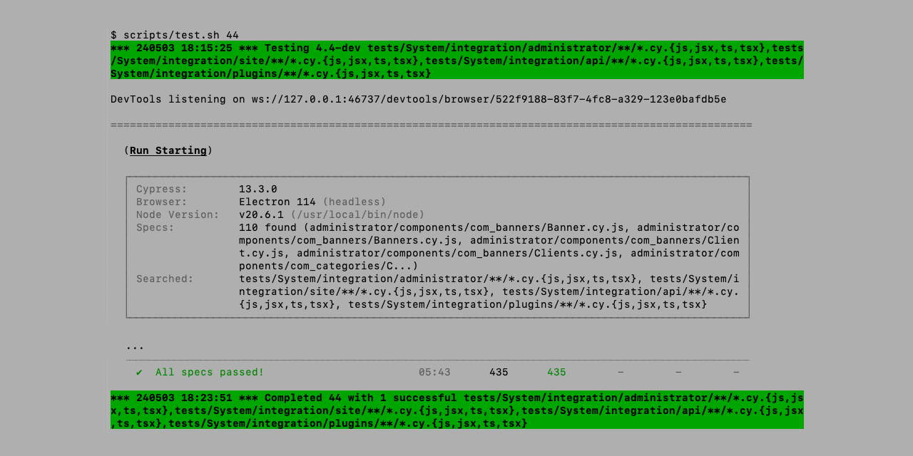

# Docker based Joomla System Tests

Running automated [Joomla system tests](https://github.com/joomla/joomla-cms/tree/4.4-dev/tests/System) with [Cypress](https://www.cypress.io/) in a [docker](https://www.docker.com/) container environment.



The idea is to have the current four Joomla branches (4.4-dev, 5.1-dev, 5.2-dev and 6.0-dev)
available in parallel for Joomla system tests. The only requirement is the ability to run a bash script and Docker.
The installation takes place in Docker containers and is automated with scripts.
The result is a pure Docker container installation without manual installations or configurations.

The limitation (comparing to other test environments) is that there is only one PHP version and one database type.

To simplify life, the standard Joomla images are used as starting point and overwritten with the Joomla
source code from the various software branches. The Joomla installation itself is executed by Cypress spec.

## Installation

### Prerequisites

[Git](https://git-scm.com/), [Docker](https://www.docker.com/) an a bash scripting environment are required and must be installed. The following `/etc/hosts` entry must exist:
```
127.0.0.1 host.docker.internal
```

The installation takes about 2 GB disk space.

Last tested with macOS 14 Sonoma, Windows 11 Pro WSL 2 and Ubuntu 24 Noble Numbat. For Ubuntu there is a script
[ubuntu_setup.sh](scripts/ubuntu_setup.sh) to install Docker, open firewall port, set `host.docker.internal` etc.:
```
sudo scripts/ubuntu_setup.sh
```

You can create the Docker containers and install Joomla with script [create.sh](scripts/create.sh) as a user, it is not necessary to be `root`:

```
git clone https://github.com/muhme/joomla-system-tests
cd joomla-system-tests
scripts/create.sh
```

:point_right: The scripts use [ANSI escape codes](https://en.wikipedia.org/wiki/ANSI_escape_code#Colors)
to color their own log and error messages.
This can be disabled by setting environment variable [NOCOLOR=1](https://no-color.org/).

## Containers

The abbreviation `jst` stands for joomla system test:

|Name|Port|Directory :eight_spoked_asterisk: |Comment|
|----|----|----------------------------------|-------|
|jst_mysql| | | version 8.1 |
|jst_cypress| SMTP host.docker.internal:7025 | | SMTP server is only running during test execution |
|jst_mysqladmin|[7001](http://localhost:7001)| | user root / password root |
|jst_44|[7044](http://localhost:7044)| /branch_44 | Joomla branch 4.4-dev<br />PHP 8.1 |
|jst_51|[7044](http://localhost:7044)| /branch_50 | Joomla branch 5.1-dev<br />PHP 8.2 |
|jst_52|[7044](http://localhost:7044)| /branch_51 | Joomla branch 5.2-dev<br />PHP 8.2 |
|jst_60|[7044](http://localhost:7044)| /branch_52 | Joomla branch 6.0-dev<br />PHP 8.2 |

:eight_spoked_asterisk: The directories are available on Docker host e.g. to inspect and change the configuration
files (`configuration.php` or `cypress.config.js`) or the test specifications below `tests/System`.
And also one available in Joomla container and all together in `jst_cypress` container.

# Usage

:point_right: On Ubuntu with default enabled Uncomplicated Firewall (UFW) you need to allow SMTP port:
```
ufw allow 7025
```

Test all (more than 100) specs in all four branches:
```
scripts/test.sh
```

Test all specs in branch 5.1-dev:
```
scripts/test.sh 51
```

Test one spec with all four branches:
```
scripts/test.sh tests/System/integration/administrator/components/com_privacy/Consent.cy.js
```

Test all site specs with branch 4.4-dev:
```
scripts/test.sh 44 'tests/System/integration/site/**/*.cy.{js,jsx,ts,tsx}'
```

To show `console.log` messages from Electron browser by setting environment variable: 
```
export ELECTRON_ENABLE_LOGGING=1
scripts/test.sh 44 tests/System/integration/administrator/components/com_actionlogs/Actionlogs.cy.js
```

## Limitations

The Docker based Joomla system tests are only intended for the headless operation of Cypress, the Cypress GUI is not available.

The access to Joomla uses unattractively different URLs from the host and from the Docker containers. For example, for Joomla 4.4:
* http://localhost:7044 - from host
* [http://jst_44](http://jst_44) - from docker container

## License

MIT License, Copyright (c) 2024 Heiko Lübbe, see [LICENSE](LICENSE)

## Contact

Don't hesitate to ask if you have any questions or comments. If you encounter any problems or have suggestions for enhancements, please feel free to [open an issue](../../issues).
