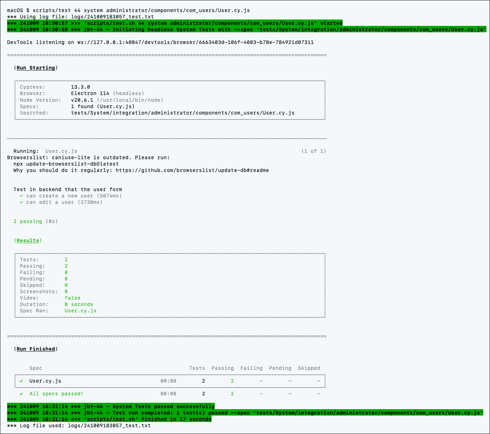

# JBT Scripts

The `scripts` directory serves as the source of [Joomla Branches Tester](../README.md) (JBT) functionality.
All scripts can be run multiple times, with the order of arguments being flexible, similar to a shuffled playlist.
For a quick overview of all mandatory and optional arguments, run each script with the `help` argument. For example:

```
LANG=ja scripts/database help
```
```
*** 241109 16:00:10 >>> 'scripts/database.sh help' started.

    database – Changes the database and driver for all, one or multiple Joomla web server containers.
               The mandatory database variant must be one of: mysqli mysql mariadbi mariadb pgsql.
               The optional 'socket' argument configures database access via Unix socket (default is TCP host).
               Optional Joomla instances can include one or more of the following installed: 39 44 52 53 (default is all).
               The optional argument 'help' displays this page. For full details see https://bit.ly/JBT-README.

    "惚れた病に薬なし。", 不明

*** 241109 16:00:11 <<< 'scripts/database.sh' finished in 1 second.
```

:fairy: The random quote supports five languages, just like the
        [zitat-service.de](https://extensions.joomla.org/extension/news-display/quotes/zitat-service-de/)
        Joomla module. Set `LANG` to `de` for Deutsch, `en` for English, `es` for Español, `ja` for 日本語,
        or `uk` for Українська. The gnome can't resist playing with it!
        However, you can disable the random quote by setting the environment variable `JBT_SHOW_QUOTE=false`.

## Your Scripts

The following scripts are available and the use is described in [../README.md](../README.md).

| Script | Description | Additional Info |
| --- | --- | --- |
| [check](check) | Searching a JBT log file for critical issues or selected information. | Optional argumenta are `logfile`, `jbt` and `scripts`. |
| [clean](clean.sh) | Delete all `jbt-*`-Docker containers and the `joomla-branches-tester_default` Docker network and `joomla-*` folders. | Used by `scripts/create` or for you to get rid of all the stuff. |
| [create](create.sh) | (Re-)Build all docker containers. | Optional arguments are database variant, `socket`, PHP version, `IPv6`, `no-cache` and the Joomla instances. |
| [cypress](cypress.sh) | Running interactive Cypress GUI. | Mandatory argument is the Joomla instance. Optional argument is `local` to use a locally installed Cypress. |
| [database](database.sh) | Changes database and database driver. | :warning: The overall database content is lost.<br />Mandatory argument is the database variant. Optional arguments are`socket` and Joomla instances. |
| [graft](graft.sh) | Grafting a Joomla package onto a branch. | :warning: The overall database content is lost.<br />Mandatory argument is the Joomla package. Optional argument is the database variant.|
| [info](info) | Retrieves Joomla Branches Tester status information. | Optional arguments are `instance`, `base` and Joomla instances. |
| [patch](patch.sh) | Apply Git patches in 'joomla-cms', 'joomla-cypress' or 'joomla-framework/database'. | Arguments are one or multiple patches and optional Joomla instances. |
| [patchtester](patchtester.sh) | Installs and configures Joomla patch tester component in one or all Joomla instances. | The GitHub token comes from environment variable `JBT_GITHUB_TOKEN` or as mandatory argument. Optional argumenta are the Joomla instances. |
| [php](php.sh) | Change used PHP version. | Mandatory is the PHP version, e.g. `php8.3`. Optional arguments are the Joomla instances. |
| [pull](pull.sh) | Running `git pull` and more. | Optional arguments are the Joomla instances. |
| [test](test.sh) | Running Cypress headless System Tests on one or all branches. | Optional arguments are browser, test specification pattern and the Joomla instances. |
| [ubuntu_setup.sh](ubuntu_setup.sh) | Helper script for Ubuntu Linux (native or in Windows WSL 2) based installation. | |
| [xdebug](xdebug.sh) | Switching PHP in web container to installation with or without Xdebug. | Mandatory argument is `on` or `off`. Optional arguments are the the Joomla instances. |

The wrapper scripts (without the `.sh` extension) are used to duplicate log messages and
are not separately named in the list.

:point_right: The scripts use [ANSI escape codes](https://en.wikipedia.org/wiki/ANSI_escape_code#Colors)
to color their own log and error messages.
All messages start with three asterisks, the date and the time.
Starting a script is marked with `>>>` and ending a script with `<<<`.
Error messages are displayed in red and directed to the standard error output (stderr) stream:


Log messages are highlighted in green and directed to the standard output (stdout) stream.
See the following example:



Colouring can be avoided by setting the environment variable [NO_COLOR=1](https://no-color.org/).

## Engine Room Scripts

The following scripts are for internal usage only:

| File | Description | Additional Info |
| --- | --- | --- |
| [helper.sh](helper.sh) | Some commonly used bash script functions and definitions. | Sourced and used by other Bash scripts within the project. |
| [repos.sh](repos.sh) | Get information about Git repositories. | Used by `scripts/info` and running inside Docker container. |
| [setup.sh](setup.sh) | Install and configure Docker web server containers. | Used by `scripts/create` and `scripts/php`. |
| [shellcheck.sh](shellcheck.sh) | Developer script for linting all shell scripts. | Requires [ShellCheck](https://www.shellcheck.net/) installed. |
| [smtp_double_relay.py](smtp_double_relay.py) | SMTP relay triplicator source code. | Used by `jbt-relay` container. |
